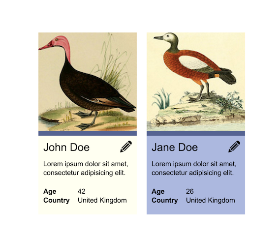

# Exam: HTML & CSS
Time needed: ~120 minutes   
100% is 16 points

### Getting Started
 - Fork this repository under your own account
 - Commit your progress frequently and with descriptive commit messages
 - All your answers and solutions should go in this repository

### What can I use?
 - You can use any resource online, but **please work individually**
 - **Don't just copy-paste** your answers and solutions, use your own words instead.


# Tasks

## 1. Build a design (~90 minutes) [10 points]
Build the following profile cards according to the design provided.   
Follow the design as closely as possible.   
Commit an HTML and a CSS file to this repository.


### Assets
John Duck | Jane Duck | Pencil icon
--------- | --------- | -----------
 |  |    

### Other data
  - Name font size: 22 pixels
  - Text size: 14 pixels
  - Font family: Arial, sans-serif

### Acceptance criteria
The task is accepted if:
  - The result follows design [2p]
  - The code follows [style guide](https://github.com/greenfox-academy/teaching-materials/blob/master/styleguide/html-css.md) [1p]
  - The CSS & HTML are [valid](https://validator.w3.org/) [1p]
  - The HTML considers semantic responsibilities [2p]
  - The CSS avoids code duplication [2p]
  - The CSS has meaningful and short selectors [2p]

Extra points for if:
  - the result is centered on the page both vertically and horizontally [2p]


## 2. Understand code (~15 minutes) [2 points]
Read the following code snippet:   
Question: **What is the height of the yellow and the blue box?** [1p] **Why?** [1p]   
Give a detailed explanation below!   
Add your answer to this README file, commit your changes to this repository.
```HTML
<!DOCTYPE html>
<html>
  <head>
    <style>
      .foo {
        background: blue;
      }
      .baz {
        height: 100px;
        width: 50px;
        background: green;
      }
      .bar {
        float: left;
        width: 30px;
        height: 150px;
        background: yellow;
      }
    </style>
  </head>
  <body>
    <div class="foo">
      <div class="bar"></div>
      <div class="baz"></div>
    </div>
  </body>
</html>
```
#### Your answer:
	The height is 250px if we turn of the float left, but it's tricky because it is floated away, and therefore we can only see a part of its real height. Because of the float the yellow box is 150px, and the blue is 2/3 of it approx 100px. Elements with it's float left or right activated will be taken out of the normal html flow, and the next element will wrap arount it's left or right side.

## 3. Explain concepts (~15 minutes) [4 points]
Add your answers to this README file, commit your changes to this repository.


### What is the CSS Box Model? [1p] What happens if you set an element's `box-sizing` property to `border-box`? [1p]
#### Your answer:
All html elements are basicly boxes, and when we use them(layout them), or talk about their design, is what we call "box model".
The css box model is a box which wraps around our html elements. The main parts (margins, borders, padding, and ofcourse the actual content). 
Border-box : we can say it reverses our normal use of box-model, if we set box-sizing: border-box; on an element padding and border are included in the width and height


### What is the difference in semantics between an `<a>` (anchor) and a `<button>` element? [1p] Give a good example of using a `<button>`. [1p]
#### Your answer:
For links we can use <a> tags, and not for form submission. And by the help of google, I find this interesting thing, search engine "crawlers" cannot follow links which are submitted by input or button, only a. So for SEO purposes it is better to use a! 
If its a form we should use button or an input, because these can submit a form on pressing the enter button, and this can help us in a better accessibility. 